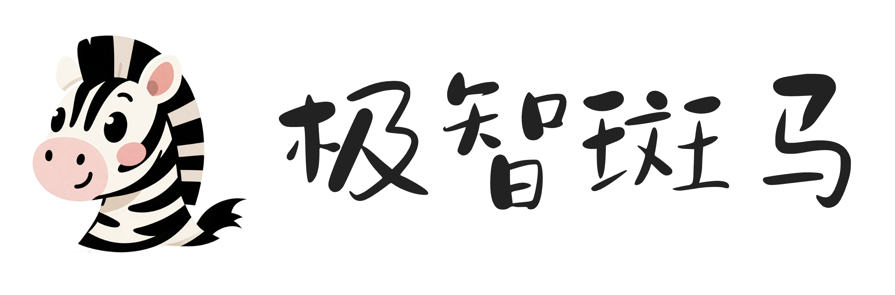
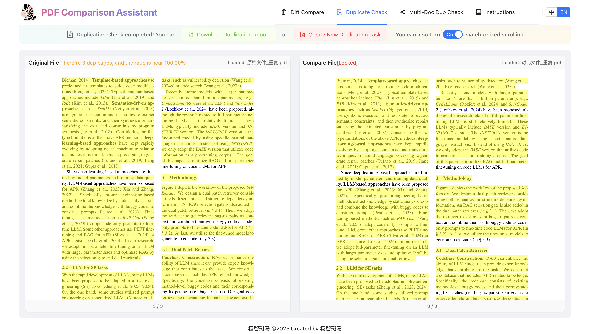

<!-- ## **JiZhiBanMa-PDF Comparison Assistant** -->

  

## 🔥🔥🔥 News!!
* July 22, 2025: 🔥 We release the stable version of PDF Duplication Detection. [Dup Detection](https://tools.jizhibanma.com/?l=en&m=dup).
* July 18, 2025: 🔥 We release the stable version of PDF Difference Comparison. [Diff Compare](https://tools.jizhibanma.com/?l=en&m=diff).

## **Abstract**
Our PDF Comparison Assistant is a powerful tool that helps users compare and analyze PDF documents. It can help you quickly identify PDF differences, accurately detect duplicate content, improve document review efficiency, and save time and effort.

## **Key Features**
### 🎉 **PDF Difference Comparison**
- High-precision text change detection
- Smart handling of table and formula differences
- Adaptive content layout changes
- Visual markers for all differences

### 🚀 **PDF Duplication Detection**
- High-precision text similarity analysis
- Identify duplicate content areas
- Generate duplicate content summary report
- Recognize formula and table structure duplicates

### 🧱 **All-in-One Comparison Engine**
- Supports multiple formats (**scanned**/text versions)
- Perfect **Chinese** and **English** content comparison
- Smart recognition of **single/double column layouts**
- Enable dual-document synchronized scrolling

## 🌅 **PDF Difference Comparison Examples**

  
  
  
  

## 🔍 **PDF Duplication Detection Examples**

  
  

## 🔥 Free Trial
- [Difference Comparison (100 QUOTA)](https://tools.jizhibanma.com/?l=en&m=diff&t=9b1a6db3-0f65-401c-bdbd-780fd82d8d17)
- [Difference Comparison (100 QUOTA)](https://tools.jizhibanma.com/?l=en&m=diff&t=24814505-ebf1-45d6-8ac9-9abb85caaa5e)
- [Difference Comparison (100 QUOTA)](https://tools.jizhibanma.com/?l=en&m=diff&t=d2b9077f-a959-4dfe-9424-d9417243a17a)
- [Difference Comparison (100 QUOTA)](https://tools.jizhibanma.com/?l=en&m=diff&t=03b2f10a-2dec-4273-99dd-23d0933fb827)

---

- [Duplication Detection (100 QUOTA)](https://tools.jizhibanma.com/?l=en&m=dup&t=555cdfe7-24ab-4409-9ac5-54f6621b85a4)
- [Duplication Detection (100 QUOTA)](https://tools.jizhibanma.com/?l=en&m=dup&t=1a269384-e66c-45d2-a325-029412a95d6d)
- [Duplication Detection (100 QUOTA)](https://tools.jizhibanma.com/?l=en&m=dup&t=488d6f33-9196-4a9d-9f27-adcb485eb7d1)
- [Duplication Detection (100 QUOTA)](https://tools.jizhibanma.com/?l=en&m=dup&t=7ef2e86a-d665-4896-a6c0-dd0c718f9564)

