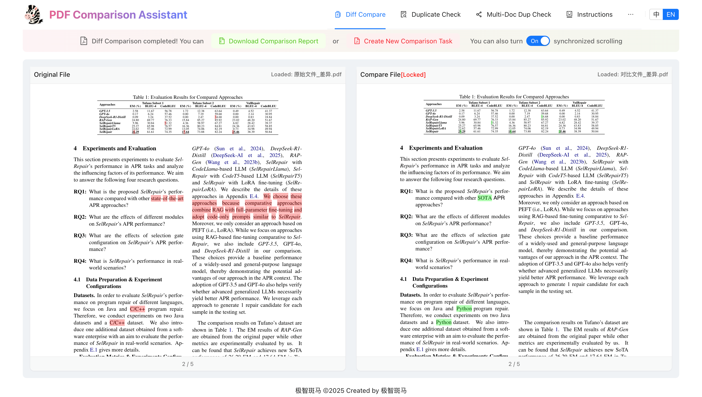

  

## 🔥🔥🔥 最新动态
* 2025年7月22日：🔥 正式发布稳定版PDF重复内容检测功能 [去检测](https://tools.jizhibanma.com/?l=zh&m=dup)
* 2025年7月18日：🔥 正式发布稳定版PDF差异对比功能 [去对比](https://tools.jizhibanma.com/?l=zh&m=diff)

## **产品概述**
极智斑马PDF智能比对工具是一款专业高效的文档分析解决方案，助力用户精准识别PDF文档差异。无论您需要核对版本变更还是排查重复内容，都能显著提升文档审阅效率，节省宝贵时间。

## **核心功能**
### 🎉 **智能差异对比**
- 高精度文本变更捕捉
- 智能解析表格公式变动
- 自适应文档版式调整
- 可视化差异标识系统

### 🚀 **深度重复检测**
- 文本相似度精准分析
- 重复区域智能定位
- 自动生成重复报告
- 表格公式结构查重

### 🧱 **全能文档处理**
- 支持扫描件/可编辑文本混排处理
- 中英双语精准解析
- 智能识别单双栏版式
- 双文档同步滚动对照

## 🌅 **差异对比效果示例**

  
  
  
  

## 🔍 **重复检测效果示例**

  
  

## 🔥 免费体验
### 差异对比（各100次额度）
- [立即体验](https://tools.jizhibanma.com/?l=zh&m=diff&t=9b1a6db3-0f65-401c-bdbd-780fd82d8d17)
- [立即体验](https://tools.jizhibanma.com/?l=zh&m=diff&t=24814505-ebf1-45d6-8ac9-9abb85caaa5e)
- [立即体验](https://tools.jizhibanma.com/?l=zh&m=diff&t=d2b9077f-a959-4dfe-9424-d9417243a17a)
- [立即体验](https://tools.jizhibanma.com/?l=zh&m=diff&t=03b2f10a-2dec-4273-99dd-23d0933fb827)

### 重复检测（各100次额度）
- [立即检测](https://tools.jizhibanma.com/?l=zh&m=dup&t=555cdfe7-24ab-4409-9ac5-54f6621b85a4)
- [立即检测](https://tools.jizhibanma.com/?l=zh&m=dup&t=1a269384-e66c-45d2-a325-029412a95d6d)
- [立即检测](https://tools.jizhibanma.com/?l=zh&m=dup&t=488d6f33-9196-4a9d-9f27-adcb485eb7d1)
- [立即检测](https://tools.jizhibanma.com/?l=zh&m=dup&t=7ef2e86a-d665-4896-a6c0-dd0c718f9564)
